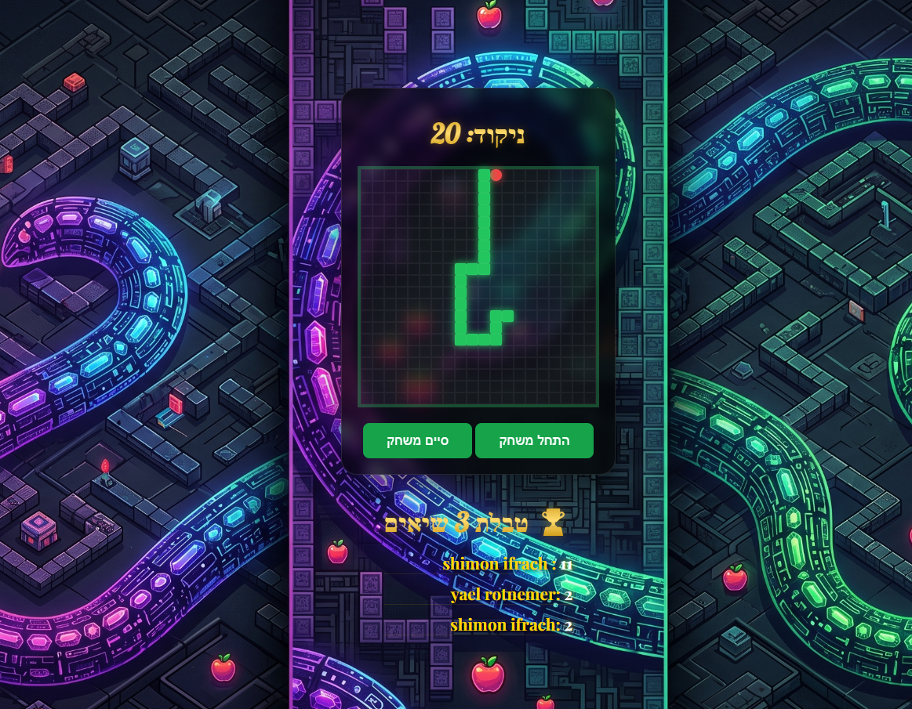

# 🐍 Snake App - Full Stack, Dockerized & Immersive

A modern, high-performance take on the classic Snake game. This project isn't just about the gameplay—it’s a full-scale **3-Tier Architecture** demonstration, featuring a decoupled frontend, a containerized backend, a cloud-hosted relational database, and a rich, immersive audio-visual experience.

---

### 🖼️ Preview
<div align="center">
  
  <p><i>The modern glassmorphism interface featuring global leaderboard integration.</i></p>
</div>

---

### ✨ Key Features
* **Global High Scores:** Your scores aren't just local. They are sent via a REST API to a central database and displayed with golden gradient typography.
* **Immersive Audio Experience:** Fully integrated Web Audio API featuring retro background music and synchronized sound effects (eat, game over) to enhance gameplay feel.
* **Modern UI/UX (Glassmorphism):** The UI uses modern CSS techniques including `backdrop-filter` for frosted glass effects, custom neon box-shadows, and curated Google Fonts (Lobster & Playfair Display).
* **Dockerized Backend:** The API server is fully containerized for consistent deployment across any environment.
* **Cloud Integration:** Real-time data sync between GitHub Pages (Frontend), Render (Backend), and Neon (Database).
* **Educational Sandbox:** The codebase includes structured comments and commented-out components (like mobile touch controls) designed specifically as exercises for computer science students.

---

### 🛠️ Tech Stack

| Layer | Technology | Hosting / Source |
| :--- | :--- | :--- |
| **Frontend** | HTML5, CSS3 (Glassmorphism), Vanilla JS (ES6+) | GitHub Pages |
| **Audio/Assets** | Web Audio API, MP3/WAV | [Pixabay](https://pixabay.com/) |
| **Backend** | Node.js, Express.js, Docker | Render |
| **Database** | PostgreSQL | Neon (Serverless Postgres) |
| **DevOps** | CI/CD Pipeline, Dockerfile, Env Vars | GitHub Actions |

---

### 🏗️ Architecture Overview

1. **Client (Presentation):** The vanilla JavaScript frontend handles game loops, audio state management, and UI rendering. It communicates with the backend via the `fetch` API.
2. **Server (Application):** A Node.js container running in a Dockerized environment. It validates incoming scores and manages the connection pool to the database.
3. **Database (Data):** A PostgreSQL instance storing player names, emails, and top 3 high scores with timestamping.

---

### 🎮 How to Play

> **Objective:** Eat the apples to grow and set a new world record! Avoid hitting the walls or your own tail.

* **Steer:** Use **Arrow Keys** or **WASD**.
* **Audio:** Background music initiates automatically upon starting the game to comply with browser autoplay policies.
* **Submit or Skip:** Once the game ends, a custom glass-styled modal will prompt you to save your score to the global leaderboard or smoothly skip via a dedicated lambda function.

---

### 🎵 Assets & Attribution
* **Sound Effects & Music:** Royalty-free audio tracks and sound effects sourced from [Pixabay](https://pixabay.com/).
* **Typography:** [Google Fonts](https://fonts.google.com/) (Lobster, Playfair Display).

---

### 🚀 Developer Setup

To run the backend locally using Docker:

1. **Clone the Backend Repository:**
   ```bash
   git clone [https://github.com/simaon78i/snake_backend.git](https://github.com/simaon78i/snake_backend.git)
2. **Build the Docker Image:**
   ```bash
   docker build -t snake-api .
3. **Run the Container:**
   ```bash
   docker run -p 10000:10000 --env DATABASE_URL="your_connection_string" snake-api
   

   
